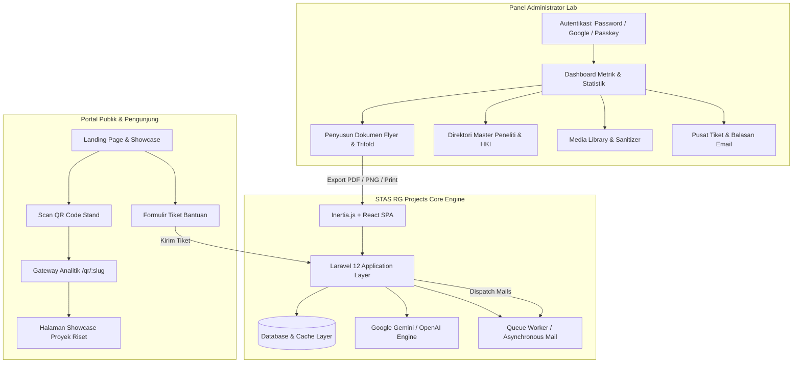

# STAS RG Projects — STAS-RG Research & Innovation Deliverables Generator

<p align="center">
  
  &nbsp;&nbsp;&nbsp;&nbsp;&nbsp;&nbsp;&nbsp;&nbsp;
  
</p>

<p align="center">
  <strong>Platform Otomasi Penyusunan Publikasi Riset, Flyer A4, Brosur Trifold, & Deliverables Standar Industri</strong><br>
  <em>Center of Excellence Sustainable Technology and Applied Sciences Research Group (CoE STAS-RG) — Telkom University</em>
</p>

<p align="center">
  
  
  
  
  
  
</p>

---

## 📚 Pusat Dokumentasi Teknis (Documentation Hub)

Untuk panduan mendalam dan spesifikasi spesifik, silakan merujuk pada direktori [`docs/`](docs/):

- 🏛️ **[Arsitektur Sistem & Spesifikasi Teknis (`docs/ARCHITECTURE.md`)](docs/ARCHITECTURE.md)** — Skema ERD, alur data, model queue asinkron, strategi caching, dan audit keamanan *enterprise hardening*.
- 📖 **[Panduan Lengkap Fitur & Penggunaan (`docs/FEATURES_AND_GUIDE.md`)](docs/FEATURES_AND_GUIDE.md)** — Panduan interaktif A4 Flyer, Trifold Brochure, AI Assistant, Helpdesk Email, Analitik QR, dan Master Peneliti/HKI.
- 🚀 **[Panduan Deployment & Operasional Produksi (`docs/DEPLOYMENT.md`)](docs/DEPLOYMENT.md)** — Panduan konfigurasi server Ubuntu, Nginx, PHP-FPM, Supervisor Worker, Cron, SSL Certbot, dan Zero-Downtime Deploy script.
- 🎨 **[Standar Design System & UI Tokens (`docs/design.md`)](docs/design.md)** — Spesifikasi visual Single Source of Truth (SSOT), palet warna Deep Forest Green, typography Plus Jakarta Sans, dan Email Layout.
- 🛠️ **[Laporan Implementasi Error Pages (`docs/walkthrough.md`)](docs/walkthrough.md)** — Dokumentasi kustomisasi penanganan error HTTP (400, 401, 403, 404, 419, 429, 500, 503).

---

## 📋 Daftar Isi (Table of Contents)

1. [Tentang Platform](#-tentang-platform)
2. [Fitur-Fitur Utama (Core Features)](#-fitur-fitur-utama-core-features)
3. [Arsitektur & Diagram Alur Kerja](#-arsitektur--diagram-alur-kerja)
4. [Teknologi yang Digunakan (Tech Stack)](#-teknologi-yang-digunakan-tech-stack)
5. [Panduan Instalasi & Pengembangan Lokal](#-panduan-instalasi--pengembangan-lokal)
6. [Konfigurasi Sistem & Environment (`.env`)](#-konfigurasi-sistem--environment-env)
7. [Struktur Direktori & Modul Utama](#-struktur-direktori--modul-utama)
8. [Panduan Integrasi AI (Gemini / OpenAI)](#-panduan-integrasi-ai-gemini--openai)
9. [Sistem Dukungan & Helpdesk Email](#-sistem-dukungan--helpdesk-email)
10. [Keamanan & Integritas Data (Enterprise Hardening)](#-keamanan--integritas-data-enterprise-hardening)
11. [Kinerja, Queueing & Caching](#-kinerja-queueing--caching)
12. [Pengujian Otomatis & Standar Kode](#-pengujian-otomatis--standar-kode)
13. [Hak Cipta & Lisensi](#-hak-cipta--lisensi)

---

## 🌟 Tentang Platform

**STAS RG Projects** adalah platform web terpadu yang dirancang untuk mendigitalkan, menstandarisasi, dan mengotomasi seluruh materi publikasi luaran riset pada **Center of Excellence for Smart Telecom, Aerospace & Security Research Group (CoE STAS-RG)** Telkom University.

Dengan platform ini, para peneliti dan administrator laboratorium tidak perlu mendesain manual lembar publikasi dari nol. Sistem secara otomatis menyusun tata letak presisi tinggi, mengenerate **QR Code interaktif**, menyediakan **asistensi konten kecerdasan buatan (AI)**, mengelola data **hak paten / HKI**, dan menghasilkan dokumen **siap cetak (A4 Flyer, Brosur Lipat Tiga, Factsheet)** serta halaman **Showcase Publik**.

---

## ✨ Fitur-Fitur Utama (Core Features)

### 1. 🖨️ Multi-Format Document Generator
- **Flyer A4 Standar Industri**: Tata letak satu lembar beresolusi tinggi dengan pilihan preset tata letak (*Balanced*, *Visual Heavy*, *Text Heavy*, *Minimalist Modern*).
- **Brosur Lipat Tiga (Trifold Brochure)**: Tata letak 3-panel independen dengan sinkronisasi atomik antar-panel inovasi.
- **Katalog Riset & Factsheet Teknis**: Penyusunan dokumen terstruktur berisi latar belakang masalah, solusi inovatif, spesifikasi hardware/software, manfaat ekonomi, dan skema arsitektur.

### 2. 🤖 Asistensi Penulisan & Terjemahan Berbasis AI
- **Generasi Draf Lengkap Otomatis**: Integrasi langsung dengan Google Gemini Flash 3.6 & OpenAI GPT-4o untuk menyusun draf riset teknis dari deskripsi singkat.
- **Polesan Bagian Spesifik (AI Polish)**: Memperbaiki tata bahasa ilmiah, menajamkan formula manfaat, dan merapikan ringkasan teknis.
- **Penerjemahan Teknis Bilingual (ID $\rightarrow$ EN)**: Terjemahan otomatis ke Bahasa Inggris standar akademik untuk persiapan publikasi internasional dan pameran global.

### 3. 👥 Direktori Peneliti & Manajemen Hak Kekayaan Intelektual (HKI)
- **Master Data Profil Akademik Peneliti**: Pengelolaan NIDN, NIP, SINTA ID, Scopus Author ID, ORCID iD, profil LinkedIn, keahlian riset, dan foto formal.
- **Modal Interaktif Pemilihan Peneliti**: Peneliti dapat langsung dipilih dan diurutkan sebagai Principal Investigator (PI), Co-PI, atau Peneliti Anggota pada setiap proyek riset.
- **Metadata Kepemilikan & Hak Paten**: Pencatatan Nomor Paten / Pendaftaran HKI resmi Ditjen KI, DOI Jurnal Internasional, dan Afiliasi Laboratorium Riset.

### 4. 🎨 Media & Verified Asset Library
- **Katalog Logo Mitra & Akreditasi**: Bank aset resmi logo industri, universitas mitra, badge ISO, sertifikasi akreditasi, dan logo hibah penelitian.
- **Sanitasi SVG Tingkat Lanjut**: Mesin pembersih SVG (`HtmlSanitizer::cleanSvg`) untuk mensterilkan tag berisiko dan event handler berbahaya sebelum disimpan ke penyimpanan server.

### 5. 📊 Real-Time Analytics & Expo QR Tracking
- **Pelacakan Interaksi QR Code Pameran**: Menghitung pemindaian kode QR pada poster booth expo secara *real-time*.
- **Wawasan Geografis & Perangkat**: Visualisasi demografi kota pemindai, jenis perangkat (Mobile, Desktop, Tablet), dan sistem operasi.
- **Peak Exhibition Hours**: Grafik distribusi jam-jam puncak interaksi pengunjung pameran (00:00 – 23:00 WIB).

### 6. 🎧 Pusat Bantuan & Layanan Terintegrasi Email (Helpdesk)
- **Formulir Tiket Publik**: Pengunjung portal dapat mengajukan pertanyaan teknis, peluang kemitraan, atau permohonan kerjasama.
- **Alur Email Dua Arah Otomatis**:
  - *Inbound Receipt Email*: Tanda terima otomatis ke pengirim dengan nomor referensi tiket resmi (`#STAS-YYYYMMDD-XXXX`).
  - *Admin Alert Email*: Notifikasi instan ke seluruh administrator dengan badge prioritas *High / Urgent*.
  - *Official Outbound Reply*: Admin dapat membalas tiket langsung dari antarmuka web dan mengirimkan email balasan resmi yang dilengkapi 4 templat tanggapan cepat 1-klik.

### 7. 🔐 Autentikasi Modern & Keamanan
- **Metode Masuk Universal**: Login Email/Password, Google OAuth 2.0 SSO, dan **Biometric Passkey (WebAuthn / Windows Hello / Touch ID)**.
- **Sistem Persetujuan Pengguna (User Approval Workflow)**: Akun baru berstatus *Pending* dan memerlukan persetujuan Superadmin sebelum dapat mengakses data internal.
- **Pemulihan Kata Sandi Aman**: Verifikasi berbasis 6-digit OTP email kriptografis.

---

## 🏛️ Arsitektur & Diagram Alur Kerja



---

## 🛠️ Teknologi yang Digunakan (Tech Stack)

| Kategori | Teknologi | Versi / Keterangan |
| :--- | :--- | :--- |
| **Backend Framework** | [Laravel](https://laravel.com/) | `v12.x` (PHP 8.3 / 8.5) |
| **Frontend UI Library** | [React](https://react.dev/) | `v19.x` |
| **Monolith Bridge** | [Inertia.js](https://inertiajs.com/) | `v3.x` (Client-side Routing SPA) |
| **CSS Utility Engine** | [Tailwind CSS](https://tailwindcss.com/) | `v4.x` (Modern Styling) |
| **Icons & Visuals** | [Lucide React](https://lucide.dev/) | Icon Set Lengkap |
| **Bundler & Build Tool** | [Vite](https://vitejs.dev/) | `v8.x` |
| **AI Integration** | Google Gemini SDK / OpenAI Client | Gemini Flash 3.6 & GPT-4o |
| **Autentikasi Biometrik** | WebAuthn / SimpleWebAuthn | W3C Standard Passkeys |
| **Database Support** | SQLite, MySQL, MariaDB, PostgreSQL | Didukung penuh |
| **Cache & Queue Driver**| Database, Redis, Sync | Non-blocking background jobs |

---

## 🚀 Panduan Instalasi & Pengembangan Lokal

### 1. Prasyarat Sistem
Pastikan perangkat pengembangan Anda telah terpasang:
- **PHP** $\ge$ 8.3 (dengan ekstensi: `pdo`, `mbstring`, `openssl`, `gd`, `fileinfo`, `curl`, `sqlite3` atau `mysql`)
- **Composer** $\ge$ 2.7
- **Node.js** $\ge$ 20.x dan **npm** $\ge$ 10.x
- **Git**

### 2. Kloning Repositori & Dependensi
```bash
# Kloning repositori
git clone https://github.com/fatintsani/stasrg-generator.git
cd stasrg-generator

# Instal dependensi backend PHP
composer install

# Instal dependensi frontend JavaScript
npm install
```

### 3. Konfigurasi Lingkungan (`.env`)
```bash
# Salin template environment
cp .env.example .env

# Generate Application Encryption Key
php artisan key:generate
```

Sesuaikan parameter database dan server email pada file `.env`:
```ini
APP_NAME="STAS-RG Generator"
APP_ENV=local
APP_DEBUG=true
APP_URL=http://localhost:8000

# Pengaturan Database (Default: SQLite)
DB_CONNECTION=sqlite
# Atau jika menggunakan MySQL:
# DB_CONNECTION=mysql
# DB_HOST=127.0.0.1
# DB_PORT=3306
# DB_DATABASE=stasrg_generator
# DB_USERNAME=root
# DB_PASSWORD=

# Pengaturan Queue & Cache
QUEUE_CONNECTION=database
CACHE_STORE=database

# Pengaturan Email (SMTP / Mailtrap / Mailpit)
MAIL_MAILER=smtp
MAIL_HOST=127.0.0.1
MAIL_PORT=1025
MAIL_USERNAME=null
MAIL_PASSWORD=null
MAIL_ENCRYPTION=null
MAIL_FROM_ADDRESS="stas.researchgroup@telkomuniversity.ac.id"
MAIL_FROM_NAME="CoE STAS-RG Telkom University"
```

### 4. Migrasi Database & Storage Symlink
```bash
# Jalankan seluruh migrasi database
php artisan migrate

# Buat symbolic link untuk folder public storage (media & avatar)
php artisan storage:link
```

### 5. Menjalankan Server Pengembangan
Gunakan perintah satu langkah berikut untuk menjalankan backend Laravel dan Vite HMR secara bersamaan:
```bash
composer run dev
```

Buka peramban Anda di: **`http://localhost:8000`**

---

## 🤖 Panduan Integrasi AI (Gemini / OpenAI)

Platform menyediakan integrasi fleksibel dengan Google Gemini dan OpenAI. Konfigurasi dapat diatur melalui menu **Pengaturan $\rightarrow$ Konfigurasi AI** di panel admin atau langsung melalui file `.env`:

```ini
# Provider: 'gemini' atau 'openai'
AI_PROVIDER=gemini

# Google Gemini API Key
GEMINI_API_KEY=AIzaSy...your_gemini_api_key

# Default Model
GEMINI_DEFAULT_MODEL=gemini-3.6-flash
```

> [!TIP]
> Fitur AI dapat diuji secara instan melalui tombol **"Uji Koneksi AI"** di halaman Pengaturan Admin untuk memverifikasi validitas kunci API.

---

## 📧 Sistem Dukungan & Helpdesk Email

Aplikasi memiliki alur manajemen tiket bantuan (*Support Tickets*) yang terhubung dengan sistem notifikasi email antrean:

| Jenis Notifikasi | Mailable Class | Penerima | Kegunaan |
| :--- | :--- | :--- | :--- |
| **Inbound Receipt** | `SupportTicketReceivedMail` | Pengirim Tiket | Konfirmasi tanda terima pesan & nomor tiket |
| **Admin Alert** | `AdminSupportTicketAlertMail` | Seluruh Admin | Pemberitahuan tiket baru dengan penanda prioritas |
| **Official Reply** | `SupportTicketReplyMail` | Pengirim Tiket | Balasan resmi laboratorium & pembaruan status |

---

## 🛡️ Keamanan & Integritas Data (Enterprise Hardening)

Platform ini telah melewati proses audit dan penguatan keamanan menyeluruh untuk kesiapan server *production*:

1. **Pencegahan Stored XSS pada Berkas Vektor**: Pembersihan mendalam pada berkas SVG yang diunggah melalui `HtmlSanitizer::cleanSvg()`.
2. **Proteksi Kehilangan Data (*Soft Deletes*)**: Model `Project` dan `Researcher` dilengkapi `SoftDeletes` untuk mencegah data riset dan tautan cetak fisik QR Code rusak permanen saat terhapus tidak sengaja.
3. **Atomisitas Transaksi Database (`DB::transaction`)**: Operasi batch seperti pembuatan 3-panel brosur lipat tiga, duplikasi proyek, dan pengiriman balasan tiket berjalan dalam transaksi atomik.
4. **Pembatasan Laju Permintaan (*Rate Limiting*)**: Mencegah serangan *denial of service* dan *database flooding* pada endpoint publik QR (`120 req/menit`), pencarian global (`60 req/menit`), dan integrasi AI (`20 req/menit`).
5. **Keamanan Sesi Biometrik**: Sesi challenge kriptografis WebAuthn langsung dimusnahkan seketika setelah autentikasi berhasil untuk mengeliminasi potensi *replay attack*.

---

## ⚡ Kinerja, Queueing & Caching

1. **Non-Blocking Asynchronous Mails**: Seluruh 10+ kelas Mailable mengimplementasikan kontrak `ShouldQueue` sehingga proses pengiriman email dieksekusi di latar belakang oleh *queue worker* tanpa menambah beban waktu muat web (*latency*).
2. **Optimasi Kueri Dashboard**: Agregasi metrik dihitung langsung pada level SQL (`COUNT`, `groupBy`) dengan pemilihan kolom selektif, menghemat alokasi memori RAM server hingga >80%.
3. **Smart Cache Layer dengan Auto-Invalidation**:
   - `SystemSetting`: Cache pengaturan otomatis dengan invalidasi pada mutasi data.
   - Landing Page (`/`): Cache data ringkasan proyek terbit dengan TTL 5 menit.
   - Kategori Proyek & Templat: Cache daftar kategori unik untuk eliminasi kueri `DISTINCT` berulang.
4. **Indeks Komposit Database Kinerja Tinggi**: Indeks komposit pada `projects` (`category`, `['user_id', 'status']`, `['status', 'created_at']`), `researchers`, dan `media_assets`.

---

## 🧪 Pengujian Otomatis & Standar Kode

### 1. Menjalankan Automated Test Suite
Aplikasi dilengkapi dengan rangkaian unit dan feature test komprehensif menggunakan PHPUnit:
```bash
php artisan test
```
*Status saat ini: **119 Passed, 100% lulus, 523 assertions**.*

### 2. Standarisasi Format Kode (Laravel Pint)
Proyek ini mengikuti standar format PSR-12 / Laravel Code Style:
```bash
vendor/bin/pint --format agent
```

---

## 👥 Tim Pengembang & Kontributor

- **Pengembang Utama**: Fatin Muflihuts Tsani ([@fatintsani](https://github.com/fatintsani))
- **Laboratorium**: Center of Excellence Sustainable Technology and Applied Sciences Research Group (CoE STAS-RG)
- **Institusi**: Fakultas Ilmu Terapan, Telkom University, Bandung, Indonesia

---

## 🔒 Lisensi & Hak Cipta

Hak Cipta © 2026 **Center of Excellence Sustainable Technology and Applied Sciences Research Group (CoE STAS-RG)** — **Telkom University**.<br>
Seluruh Hak Cipta Dilindungi Undang-Undang (*All Rights Reserved*).
