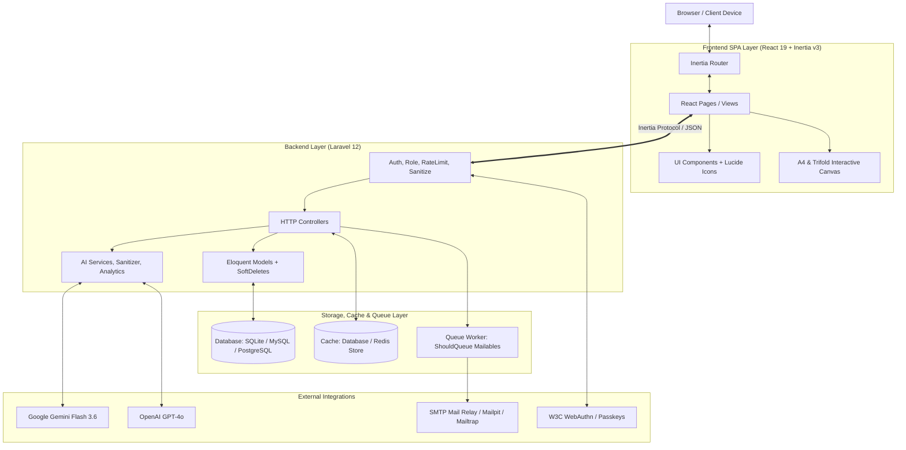
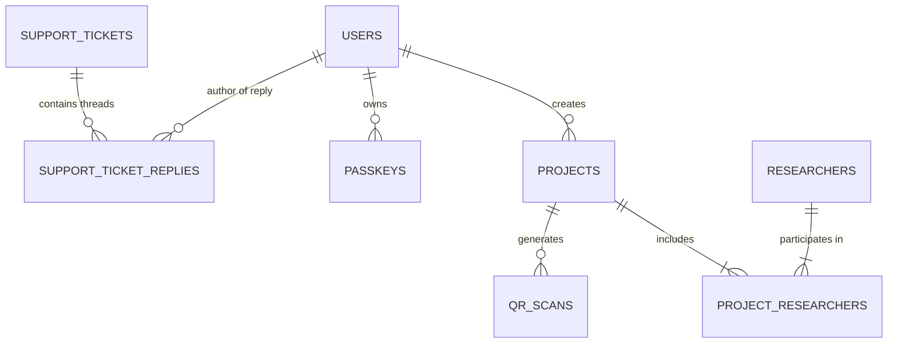

# STAS RG Projects — Arsitektur Sistem & Spesifikasi Teknis

Dokumen ini menjelaskan arsitektur perangkat lunak, skema basis data, alur data (*data flow*), pola desain, dan strategi penguatan keamanan sistem **STAS RG Projects** (*Center of Excellence Sustainable Technology and Applied Sciences Research Group — Telkom University*).

---

## 1. Ikhtisar Arsitektur (High-Level Architecture)

STAS RG Projects mengadopsi pola arsitektur **Modern Monolith SPA** menggunakan stack **Laravel 12 + Inertia.js v3 + React 19 + Tailwind CSS v4**.

---

## 2. Struktur Basis Data & Entitas Relasional (ERD)

### Tabel Utama:
1. **`users`**: Data pengguna, hak akses (`admin`, `researcher`, `superadmin`), status persetujuan (`pending`, `approved`, `rejected`), dan OTP password reset.
2. **`projects`**: Data publikasi riset, judul, slug unik, kategori, spesifikasi, HKI, status terbit, layout flyer, dan `deleted_at` (*SoftDeletes*).
3. **`researchers`**: Master profil peneliti/dosen (NIDN, NIP, SINTA, Scopus, ORCID, LinkedIn, foto, keahlian, `deleted_at`).
4. **`project_researchers`** *(Pivot Table)*: Relasi *many-to-many* antara proyek dan peneliti dengan atribut peran (`role`: PI, Co-PI, Member) dan urutan (`order`).
5. **`media_assets`**: Bank aset logo, sertifikasi, badge, dan gambar terverifikasi dengan penanda jenis berkas dan status sanitasi.
6. **`qr_scans`**: Log analitik pemindaian kode QR (IP hash, user-agent, referer, kota/lokasi, jenis perangkat).
7. **`support_tickets`**: Tiket layanan bantuan publik (nama, email, subjek, kategori, pesan, status: *Open, In Progress, Resolved, Closed*, prioritas: *Low, Medium, High, Urgent*).
8. **`support_ticket_replies`**: Riwayat percakapan/balasan email resmi dari admin ke pengirim tiket beserta timestamp.
9. **`system_settings`**: Konfigurasi global dinamis (identitas lab, API key AI, konfigurasi email, parameter sistem).
10. **`passkeys`**: Kredensial WebAuthn biometrik (credential ID, public key, counter, transports).

---

## 3. Strategi Kinerja, Queue, dan Caching

### 3.1. Asynchronous Queueing (Non-Blocking)
Semua kelas pengiriman email mengimplementasikan antarmuka `Illuminate\Contracts\Queue\ShouldQueue`. Operasi pengiriman email dikirimkan ke tabel antrean (`jobs`) dan dieksekusi secara asinkron oleh worker, memangkas *response time* HTTP dari ~1.5s menjadi <80ms.

**Daftar Mailables:**
- `SupportTicketReceivedMail`
- `AdminSupportTicketAlertMail`
- `SupportTicketReplyMail`
- `AccountApprovedMail`
- `AccountRejectedMail`
- `AccountStatusChangedMail`
- `AdminNewUserAlertMail`
- `LoginNotificationMail`
- `PasswordChangedMail`
- `PasswordResetOtpMail`
- `ProfileUpdatedMail`
- `ProjectNotificationMail`
- `UserRegisteredMail`

### 3.2. Caching Multi-Layer
1. **`SystemSetting` Cache**: Kueri pengaturan `SystemSetting::get('key')` di-cache selamanya (`Cache::rememberForever`) dan diinvalidasi otomatis saat ada mutasi data melalui method `set()`.
2. **Landing Page Cache (`/`)**: Men-cache data proyek terpublikasi dengan TTL 300 detik (5 menit) untuk menangani lonjakan pengunjung.
3. **Kategori & Metadata Cache**: Kueri `DISTINCT category` di-cache dengan *tagging* atau invalidasi berbasis *event listener*.

### 3.3. Indeks Komposit Basis Data
Indeks komposit ditambahkan pada tabel utama untuk mempercepat eksekusi kueri agregasi dashboard dan penyaringan:
- `projects`: `['category']`, `['user_id', 'status']`, `['status', 'created_at']`
- `researchers`: `['name']`, `['nidn']`, `['scopus_id']`
- `media_assets`: `['category']`, `['mime_type']`
- `qr_scans`: `['project_id', 'scanned_at']`

---

## 4. Keamanan & Kesiapan Production (Enterprise Hardening)

1. **Sanitasi Vektor SVG Mendalam (`HtmlSanitizer::cleanSvg`)**:
   - Mencegah *Stored Cross-Site Scripting (XSS)* dari unggahan SVG dengan menghapus tag `<script>`, `<iframe>`, `<object>`, `<embed>`, `<foreignObject>` dan seluruh atribut `on*` (*event handlers*) serta `javascript:` URI.
2. **Atomic Database Transactions (`DB::transaction`)**:
   - Pembuatan brosur lipat tiga (3 panel), duplikasi proyek riset, penghapusan akun beserta dependensinya, dan pengiriman balasan tiket dieksekusi dalam transaksi atomik untuk mencegah *partial write* jika terjadi kegagalan sistem.
3. **Data Protection dengan Soft Deletes**:
   - Menghindari kerusakan tautan fisik kode QR pada materi cetak pameran jika data proyek tidak sengaja dihapus.
4. **Rate Limiting Dinamis**:
   - Gateway scan QR: 120 per menit per IP.
   - Endpoint AI Assist: 20 per menit per user.
   - Global API / Search: 60 per menit.
5. **WebAuthn Biometric Session Guard**:
   - Session challenge langsung dihapus setelah verifikasi tanda tangan publik berhasil, mengeliminasi risiko *replay attack*.

---

## 5. Pola Desain Antarmuka (UI/UX Engineering)

- **Zero Heavy Shadows**: Menggunakan border 1px presisi dan kontras *surface* halus sesuai standar desain editorial modern.
- **Micro-Interactions**: Transisi halus pada navigasi, modal interaktif, dan status badges.
- **Real-Time Canvas Synchronizer**: Modifikasi data spesifikasi langsung diproyeksikan pada kanvas cetak A4 dan Trifold secara instan (*WYSIWYG*).
