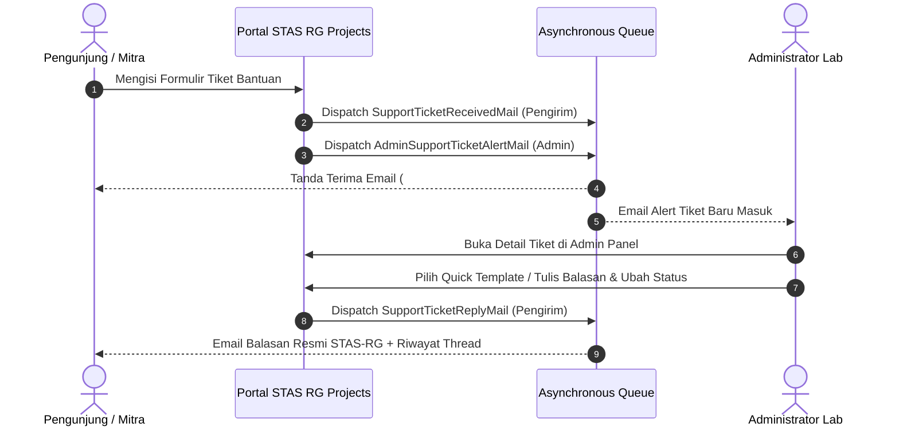

# STAS RG Projects — Panduan Fitur & Penggunaan Lengkap

Panduan ini mendokumentasikan seluruh modul fungsional, tata cara penggunaan, dan alur kerja (*workflows*) pada sistem **STAS RG Projects**.

---

## 📋 Modul-Modul Utama

### 1. 📄 Document Generator (A4 Flyer & Trifold Brochure)

#### A4 Research Flyer
- **Tujuan**: Menghasilkan satu lembar dokumen ringkas publikasi inovasi riset untuk keperluan poster, pameran, atau selebaran resmi.
- **Pilihan Layout**:
  1. *Balanced Layout*: Komposisi seimbang antara gambar arsitektur, ringkasan inovasi, dan tabel spesifikasi teknis.
  2. *Visual Heavy Layout*: Fokus pada visual produk, foto prototipe, dan skema perangkat keras.
  3. *Text Heavy Layout*: Komposisi naratif untuk riset dengan metodologi kompleks atau analisis mendalam.
  4. *Minimalist Modern*: Desain editorial kontemporer dengan tipografi bersih.
- **Fitur Ekspor**:
  - Cetak langsung (*Browser Print Engine*) dengan layout terkalibrasi ke ukuran kertas A4 (210mm x 297mm).
  - Ekspor PDF & Gambar resolusi tinggi (300 DPI) siap cetak offset/digital.

#### Brosur Lipat Tiga (Trifold Brochure)
- **Tujuan**: Menghasilkan materi promosi lipat tiga berstandar pameran internasional.
- **3 Panel Independen**:
  - *Cover / Luar Depan*: Identitas riset, nama lab CoE STAS-RG, logo Telkom University, dan ringkasan eksekutif.
  - *Panel Dalam / Solusi*: Arsitektur sistem, keunggulan komparatif, dan tabel spesifikasi.
  - *Panel Belakang / Kontak & HKI*: Profil peneliti utama, nomor paten/HKI, QR code pameran, dan kontak kemitraan.
- **Sinkronisasi Atomik**: Pembuatan 3 panel disimpan serentak dalam transaksi basis data terpadu.

---

### 2. 🤖 Asistensi Kecerdasan Buatan (AI Content Assistant)

STAS RG Projects dilengkapi mesin AI fleksibel yang mendukung **Google Gemini Flash 3.6** dan **OpenAI GPT-4o**.

#### Fitur-Fitur AI:
1. **Auto-Draft Complete Project**: Menghasilkan draf lengkap (latar belakang masalah, solusi inovasi, spesifikasi, dan manfaat) hanya dari judul atau konsep singkat.
2. **AI Section Polish**:
   - Menajamkan gaya bahasa akademik (*academic tone*).
   - Memperbaiki tata bahasa dan ejaan ilmiah.
   - Merapikan struktur bullet poin manfaat ekonomi dan sosial.
3. **Bilingual Academic Translator (ID $\rightarrow$ EN)**:
   - Menerjemahkan istilah teknis secara akurat ke Bahasa Inggris akademik untuk persiapan pameran internasional (*expo ready*).

---

### 3. 👥 Direktori Peneliti & Manajemen HKI

#### Master Profil Peneliti:
- Pengelolaan metadata identitas akademik dosen dan peneliti:
  - **NIDN / NIP**
  - **SINTA Author ID**
  - **Scopus Author ID**
  - **ORCID iD**
  - **LinkedIn Profile URL**
  - **Bidang Keahlian / Research Keywords**
  - **Foto Profil Formal**

#### Integrasi dengan Proyek Riset:
- Peneliti dapat ditambahkan ke proyek dengan peran spesifik:
  - *Principal Investigator (PI)* / Ketua Peneliti
  - *Co-Principal Investigator (Co-PI)* / Wakil Ketua
  - *Member* / Peneliti Anggota
- Mendukung pengurutan (*reordering*) posisi peneliti pada lembar dokumen cetak.

#### Pencatatan Paten & HKI:
- Nomor Permohonan / Sertifikat Paten resmi Ditjen KI Kemenkumham RI.
- Nomor Pencatatan Hak Cipta Karya Tulis / Perangkat Lunak.
- Tautan DOI Jurnal Ilmiah bereputasi (Scopus/SINTA).

---

### 4. 📊 Real-Time Analytics & Expo QR Tracking

- **Kode QR Interaktif Dinamis**: Setiap proyek menghasilkan kode QR unik yang mengarah ke gateway `/qr/{slug}`.
- **Data yang Direkam**:
  - Total Pemindaian (*Scan Count*).
  - Waktu pemindaian persis (*Timestamp*).
  - Jenis Perangkat (Mobile, Desktop, Tablet) dan Sistem Operasi (Android, iOS, Windows, macOS).
  - Lokasi geografis (Kota / IP Region).
  - Jam-jam Puncak Interaksi (*Peak Hours Chart* dari jam 00:00 - 23:00 WIB).
- **Showcase Publik**: Pengunjung yang memindai langsung diarahkan ke halaman web showcase proyek berdesain responsif tanpa perlu login.

---

### 5. 🎧 Pusat Bantuan & Layanan Tiket (Helpdesk Email)

Sistem tiket dua arah terintegrasi penuh untuk melayani pertanyaan pengunjung, calon mitra industri, atau mahasiswa:

#### Alur Kerja Tiket:

#### Fitur Utama Panel Admin Tiket:
- **4 Templat Balasan Cepat (Quick Responses)**:
  1. *Konfirmasi Informasi Tambahan*
  2. *Tawaran Kerjasama / Kemitraan Riset*
  3. *Penyelesaian Kendala Teknis*
  4. *Penutupan Tiket / Selesai*
- **Timeline Percakapan Lengkap**: Menampilkan seluruh riwayat balasan admin dan waktu pengirimannya secara kronologis.
- **Pembaruan Status Cerdas**: Otomatis memperbarui status tiket menjadi `in_progress` atau `resolved` saat admin mengirimkan pesan balasan.

---

### 6. 🔐 Autentikasi Modern & Alur Persetujuan Akun

1. **Metode Masuk**:
   - Email & Kata Sandi standar.
   - Google Single Sign-On (OAuth 2.0).
   - Biometric Passkey (WebAuthn / Windows Hello / Apple Touch ID / Android Biometrics).
2. **User Approval Lifecycle**:
   - Pendaftaran baru $\rightarrow$ Status: `pending`.
   - Admin menerima email notifikasi pendaftaran (`AdminNewUserAlertMail`).
   - Admin menyetujui akun $\rightarrow$ Pengguna menerima email persetujuan (`AccountApprovedMail`) dan akun aktif.
   - Jika ditolak $\rightarrow$ Pengguna menerima email penolakan (`AccountRejectedMail`).
3. **Password Reset OTP**:
   - Pengiriman 6-digit kode OTP kriptografis dengan masa berlaku 15 menit.
